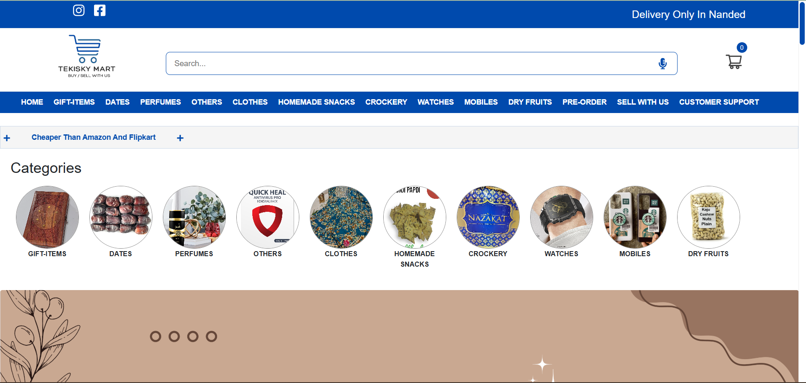

# Modern 3D Portfolio Website

<div align="center">
  
  <h1>Mahesh's Portfolio Website</h1>
  <div>
    
    
    
    
  </div>
</div>

## 📋 Table of Contents

1. [Overview](#overview)
2. [Features](#features)
3. [Tech Stack](#tech-stack)
4. [Installation](#installation)
5. [Environment Setup](#environment-setup)
6. [Project Structure](#project-structure)
7. [Performance Optimizations](#performance-optimizations)
8. [Contact](#contact)

## 🌟 Overview <a name="overview"></a>

This is a modern 3D portfolio website built with React and Three.js. It showcases my skills, experience, projects and provides a way for potential clients or employers to contact me. The website features immersive 3D elements, smooth animations, and a responsive design that works across all devices.

[Live Demo](https://mahesh-portfolio.netlify.app/) (Replace with your actual live demo link when deployed)

<div align="center">
  
</div>

## 🔋 Features <a name="features"></a>

- **Interactive 3D Hero Section**: Featuring a customizable 3D desktop model
- **Dynamic 3D Skill Icons**: Tech stack displayed as interactive 3D elements
- **Experience Timeline**: Animated work history section
- **Project Showcase**: Gallery of projects with descriptions and links
- **Testimonials Section**: Client feedback with smooth carousel
- **Contact Form**: Integrated with EmailJS for direct messaging
- **Animated Earth**: Interactive 3D earth model in the contact section
- **Star Field Background**: Dynamic 3D star field that responds to movement
- **Fully Responsive Design**: Optimized for all screen sizes
- **Performance Optimized**: Conditional rendering for better performance on mobile devices

## ⚙️ Tech Stack <a name="tech-stack"></a>

- **Frontend Framework**: React.js
- **3D Graphics**: Three.js, React Three Fiber, React Three Drei
- **Animation**: Framer Motion, GSAP
- **Styling**: Tailwind CSS
- **Build Tool**: Vite
- **Email Service**: EmailJS
- **Deployment**: Netlify (or your preferred hosting)

## 🚀 Installation <a name="installation"></a>

To run this project locally:

1. Clone this repository
```bash
git clone https://github.com/yourusername/portfolio-website.git
cd portfolio-website
```

2. Install dependencies
```bash
npm install
```

3. Start the development server
```bash
npm run dev
```

4. Open your browser and visit `http://localhost:5173`

## 🔧 Environment Setup <a name="environment-setup"></a>

For the contact form functionality, create a `.env` file in the root directory with the following variables:

```env
VITE_EMAILJS_SERVICE_ID=your_emailjs_service_id
VITE_EMAILJS_TEMPLATE_ID=your_emailjs_template_id
VITE_EMAILJS_PUBLIC_KEY=your_emailjs_public_key
```

You can get these credentials by creating an account on [EmailJS](https://www.emailjs.com/).

## 📁 Project Structure <a name="project-structure"></a>

```
portfolio-website/
├── public/              # Public assets and 3D models
│   ├── desktop_pc/      # 3D Computer model
│   └── planet/          # 3D Earth model
├── src/
│   ├── assets/          # Images and icons
│   ├── components/      # React components
│   │   ├── canvas/      # Three.js components
│   │   └── ...          # Other components
│   ├── constants/       # Project constants and data
│   ├── hoc/             # Higher Order Components
│   ├── utils/           # Utility functions
│   ├── App.jsx          # Main App component
│   └── main.jsx         # Entry point
└── ...                  # Config files
```

## ⚡ Performance Optimizations <a name="performance-optimizations"></a>

- **Conditional Rendering**: 3D models are not rendered on mobile devices to improve performance
- **Suspense and Preload**: Components use React Suspense and Three.js preloading
- **Compressed Textures**: Optimized 3D textures for faster loading
- **Code Splitting**: Components are loaded only when needed

## 📞 Contact <a name="contact"></a>

Feel free to reach out to me if you have any questions or would like to work together:

- **Email**: shekokarmahesh@gmail.com
- **LinkedIn**: [Mahesh Shekokar](https://www.linkedin.com/in/mahesh-shekokar/)
- **GitHub**: [Mahesh's GitHub](https://github.com/mahesh-shekokar)

---

<div align="center">
  <p>Designed & Developed by Mahesh Shekokar © 2023</p>
</div>
